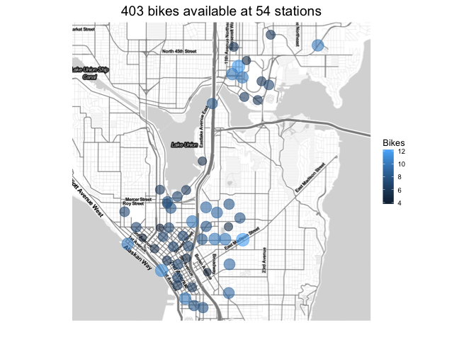

<!-- README.md is generated from README.Rmd. Please edit that file -->
pronto
======

pronto is a simple R package for interacting with data from from Seattle's [Pronto](http://www.prontocycleshare.com) cycle sharing system. Data comes from Pronto's [data stream](https://secure.prontocycleshare.com/data/stations.json), which is described [here](http://www.prontocycleshare.com/assets/pdf/JSON.pdf).

This project is released with a [Contributor Code of Conduct](CONDUCT.md). By participating in this project you agree to abide by its terms.

Installation
============

`pronto` is not on [CRAN](http://cran.r-project.org/), but you can install the latest and greatest version using [devtools](http://cran.r-project.org/web/packages/devtools/index.html):

``` r
if(!require("devtools")) install.packages("devtools")                       
devtools::install_github("briandconnelly/pronto")
```

Examples
========

Get current station data
------------------------

``` r
library(pronto)

s <- pronto_stations()
```

The result, `s`, is a list containing a `timestamp` for the data, whether or not rentals across the system are suspended (`schemeSuspended`), and a data frame containing information about all of the stations (`stations`).

`stations` looks like this:

|   id| s                              | n      |   st| b     | su    | m     |            lu|            lc| bk    | bl    |        la|         lo|   da|   dx|   ba|   bx|
|----:|:-------------------------------|:-------|----:|:------|:------|:------|-------------:|-------------:|:------|:------|---------:|----------:|----:|----:|----:|----:|
|    1| 3rd Ave & Broad St             | BT-01  |    1| FALSE | FALSE | FALSE |  1.458057e+12|  1.458065e+12| FALSE | FALSE |  47.61842|  -122.3510|   10|    0|    7|    1|
|    2| 2nd Ave & Vine St              | BT-03  |    1| FALSE | FALSE | FALSE |  1.458058e+12|  1.458065e+12| TRUE  | TRUE  |  47.61583|  -122.3486|   11|    0|    4|    1|
|    3| 6th Ave & Blanchard St         | BT-04  |    1| FALSE | FALSE | FALSE |  1.458064e+12|  1.458066e+12| TRUE  | TRUE  |  47.61609|  -122.3411|    8|    0|    7|    1|
|    4| 2nd Ave & Blanchard St         | BT-05  |    1| FALSE | FALSE | FALSE |  1.458059e+12|  1.458066e+12| TRUE  | TRUE  |  47.61311|  -122.3442|    7|    0|    5|    1|
|    5| 2nd Ave & Pine St              | CBD-13 |    1| FALSE | FALSE | FALSE |  1.458062e+12|  1.458065e+12| TRUE  | TRUE  |  47.61018|  -122.3396|    9|    1|    6|    2|
|    6| 7th Ave & Union St             | CBD-03 |    1| FALSE | FALSE | FALSE |  1.458061e+12|  1.458066e+12| TRUE  | TRUE  |  47.61073|  -122.3324|    8|    1|    5|    6|
|    7| City Hall / 4th Ave & James St | CBD-07 |    1| FALSE | FALSE | FALSE |  1.458066e+12|  1.458066e+12| TRUE  | TRUE  |  47.60351|  -122.3304|   10|    0|    6|    0|
|    8| Pine St & 9th Ave              | SLU-16 |    1| FALSE | FALSE | FALSE |  1.458063e+12|  1.458065e+12| TRUE  | TRUE  |  47.61371|  -122.3318|    5|    1|    7|    1|
|    9| 2nd Ave & Spring St            | CBD-06 |    1| FALSE | FALSE | FALSE |  1.458057e+12|  1.458065e+12| TRUE  | TRUE  |  47.60595|  -122.3358|    9|    2|    7|    0|
|   10| Summit Ave & E Denny Way       | CH-01  |    1| FALSE | FALSE | FALSE |  1.458063e+12|  1.458065e+12| TRUE  | TRUE  |  47.61863|  -122.3252|    5|    1|    8|    2|

Getting information for a single station
----------------------------------------

Although Pronto's API doesn't support querying a single station, we can easily filter the station data using [dplyr](https://cran.r-project.org/web/packages/dplyr/index.html).

``` r
library(pronto)
library(dplyr)

s <- pronto_stations()

# Get information about the station near Fred Hutch
s_fhcrc <- s$stations %>%
    filter(id == 22)
```

Mapping available bikes
-----------------------

Let's make a map of current bike availability across the city using [ggmap](https://github.com/dkahle/ggmap).

``` r
library(pronto)
library(dplyr)
library(magrittr)
library(ggplot2)
library(ggmap)

s <- pronto_stations()

avail <- s$stations %>%
    filter(su == FALSE) %>%
    summarise(StationsAvail=n(), BikesAvail=sum(ba))

map <- get_map(location = c(lon=mean(range(s$stations$lo)),
                            lat=mean(range(s$stations$la))),
               zoom = 13, maptype = "toner-lite")
p <- ggmap(map) +
    geom_point(data = s$stations,
               aes(x=lo, y=la, size=ba, color=ba), alpha = 0.6) +
    scale_size_area(guide=FALSE) +
    scale_color_continuous(name = "Bikes") +
    scale_alpha_continuous(guide = FALSE) +
    ggtitle(sprintf("%d bikes available at %d stations", avail$BikesAvail, avail$StationsAvail)) +
    theme_minimal() +
    theme(axis.text = element_blank()) +
    theme(axis.title = element_blank()) +
    theme(legend.title = element_text(size = rel(0.8))) +
    theme(legend.text = element_text(size = rel(0.6))) +
    theme(legend.key.size = unit(0.8, "lines"))
p
```

<!-- -->

### An animated version

Let's spice it up. Here, we'll get the station data every 60 seconds for one hour and then create an animated map using [gganimate](https://github.com/dgrtwo/gganimate). *Note: this code will take an hour to run.*

For extra credit, we could show the time stamps in a more friendly format or interpolate the data using [tweenr](https://github.com/thomasp85/tweenr).

``` r
library(pronto)
library(dplyr)
library(ggplot2)
library(ggmap)
library(gganimate)

stationdata <- data.frame()
for (i in seq(60)) {
    s <- pronto_stations()
    s$stations$timestamp <- s$timestamp
    stationdata <- bind_rows(stationdata, s$stations)
    Sys.sleep(60)
}

map <- get_map(location = c(lon=mean(range(s$stations$lo)), lat=mean(range(s$stations$la))),
               zoom = 13, maptype = "toner-lite")
p <- ggmap(map) +
    geom_point(data = stationdata,
               aes(x=lo, y=la, size=ba, color=ba, frame = timestamp),
               alpha = 0.6) +
    scale_size_area(guide=FALSE) +
    scale_color_continuous(name = "Bikes") +
    scale_alpha_continuous(guide = FALSE) +
    theme_minimal() +
    theme(axis.text = element_blank()) +
    theme(axis.title = element_blank()) +
    theme(legend.title = element_text(size = rel(0.8))) +
    theme(legend.text = element_text(size = rel(0.6))) +
    theme(legend.key.size = unit(0.8, "lines"))
gg_animate(p, pause = 0.5, title_frame = FALSE)
```

Finding the closest bike
------------------------

We've just picked up some wine at [Pete's](http://www.peteswineshop.com) and need to get to the party. To find the nearest bike, we can use [fossil](https://cran.r-project.org/web/packages/fossil/index.html) to calculate the distances between our location (`here`) and each station. Unfortunately, this won't tell you about hills.

``` r
library(pronto)
library(fossil)
library(dplyr)
library(magrittr)

here <- list(lo = -122.329401, la = 47.639821)

closest_station <- pronto_stations()$stations %>%
    mutate(dist_km = deg.dist(.$lo, .$la, here$lo, here$la)) %>%
    arrange(dist_km) %>%
    filter(ba > 0) %>%           # make sure there's a bike available
    filter(su == FALSE) %>%      # make sure the station is operating
    head(n = 1)

cat(sprintf("The %s station is %.02f km away and has %d bike(s) available",
            closest_station$s, closest_station$dist_km, closest_station$ba))
#> The E Blaine St & Fairview Ave E station is 0.59 km away and has 5 bike(s) available
```

Disclaimer
==========

Neither this package nor its contributer(s) are affiliated with Pronto.
